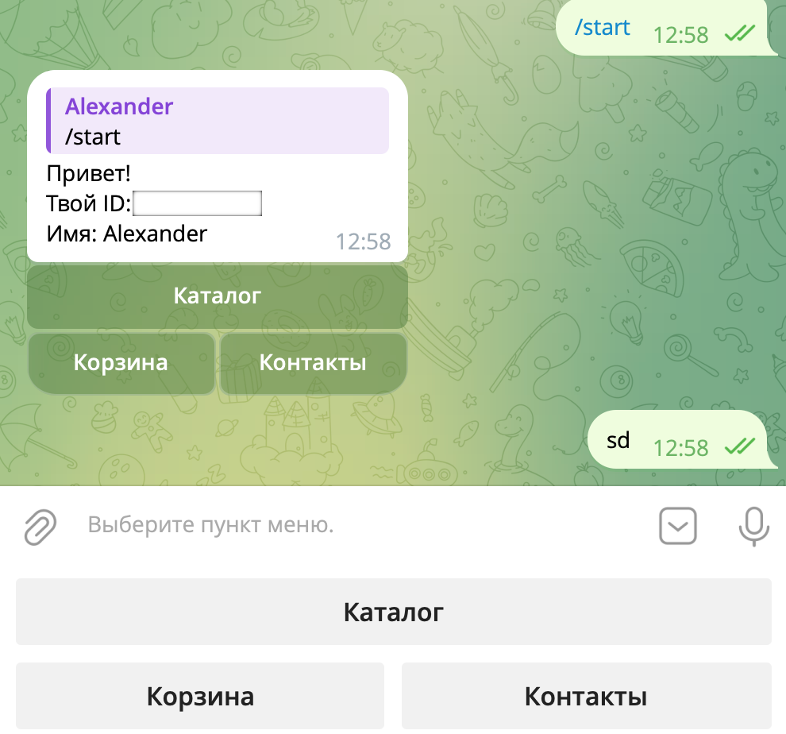

# О проекте

Первый проект на aiogram. Базовое логическое разделение логики на handlers.py, keyboards.py, middlewares.py.

## Запуск проекта

Сделать клон репозитория

```commandline
$ git clone https://github.com/AlexanderBeli/TelegramBotFirstExperience.git
```
Перейти в папку проекта

```commandline
$ cd TelegramBotFirstExperience
```
Установить и запустить окружение

Установить зависимости
```commandline
$ pip install -r requirements.txt
```
Создать свой файл config.py
Задать в нем переменную TOKEN.

Можно запускать

## License

This project is open-sourced software licensed under the [MIT license](https://opensource.org/licenses/MIT).
